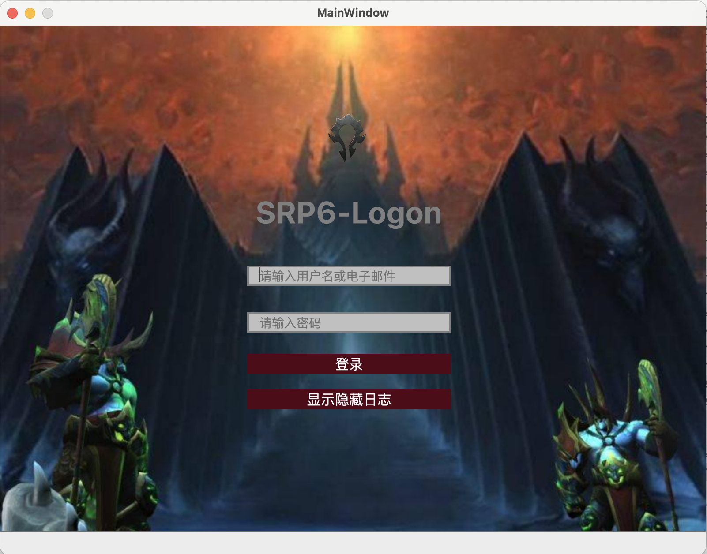
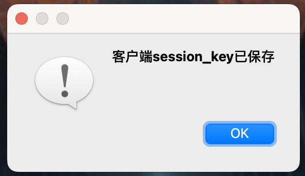

# SRP6ClientForQt6 
### Qt6实现SRP6客户端

### 1.项目简介

SRP6客户端实现,基于openssl库的bignumber进行加密计算

#### 2.项目配置
`
用到了openssl库以实现SRP6 BigNumber计算,项目配置文件中设置openssl头文件搜索路径及动态连接库路径即可

示例配置为mac m1上的路径,其他平台可修改为对应的路径

INCLUDEPATH += /opt/homebrew/include

LIBS += -L/opt/homebrew/opt/openssl@3.2/lib -lssl -lcrypto

需要修改Qt(*SRP6ClientForQt6/mainwindow.cpp line 37*)项目中的服务端mpool服务运行的IP、端口

*ip = "127.0.0.1";*

*port = 1234;*

`

### 3.运行示例

### 4.验证成功
输入在PHP项目([运行](github.com/php))中注册的用户名及密码，提示如下即为登录成功

